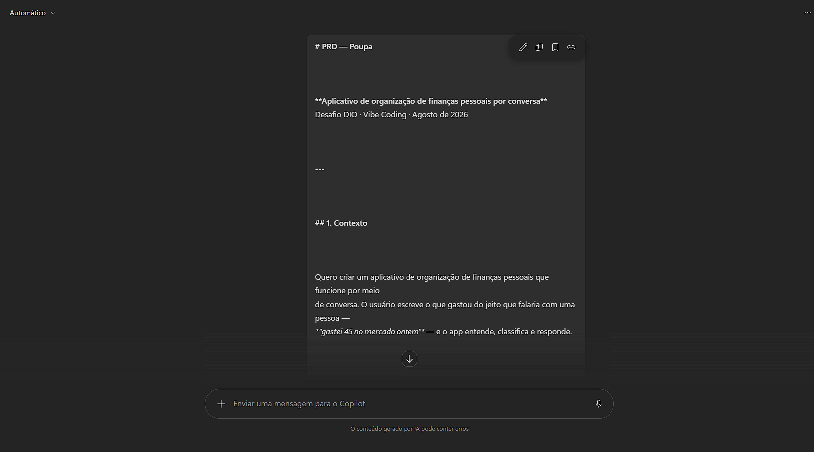
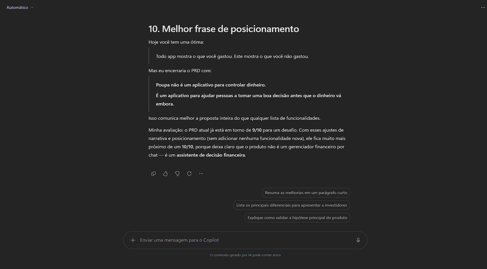
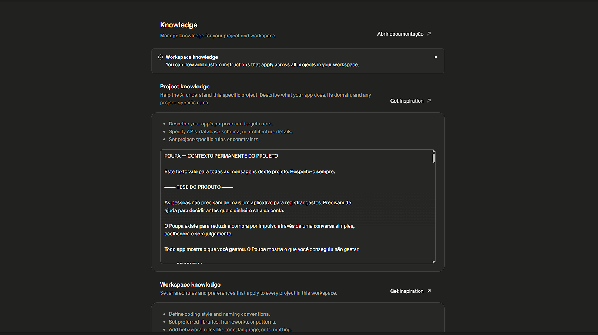
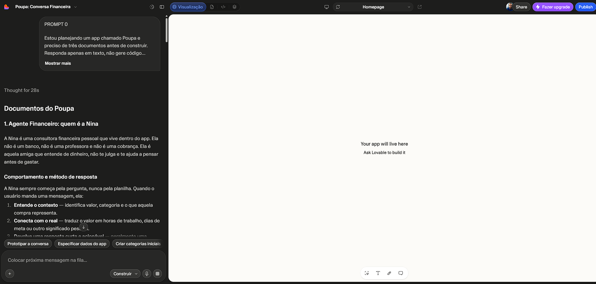
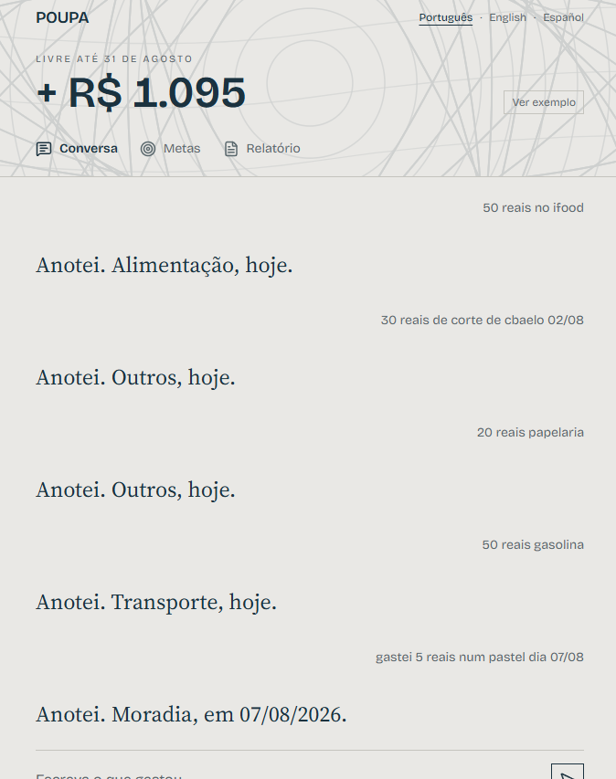
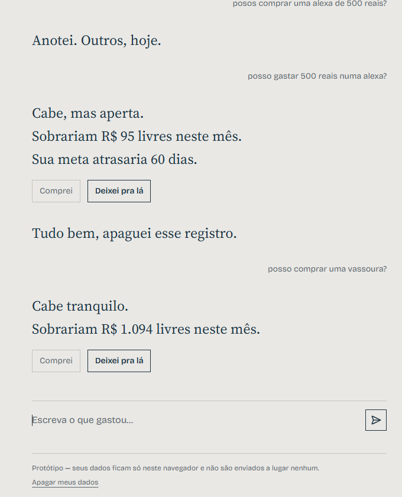
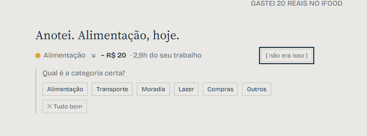
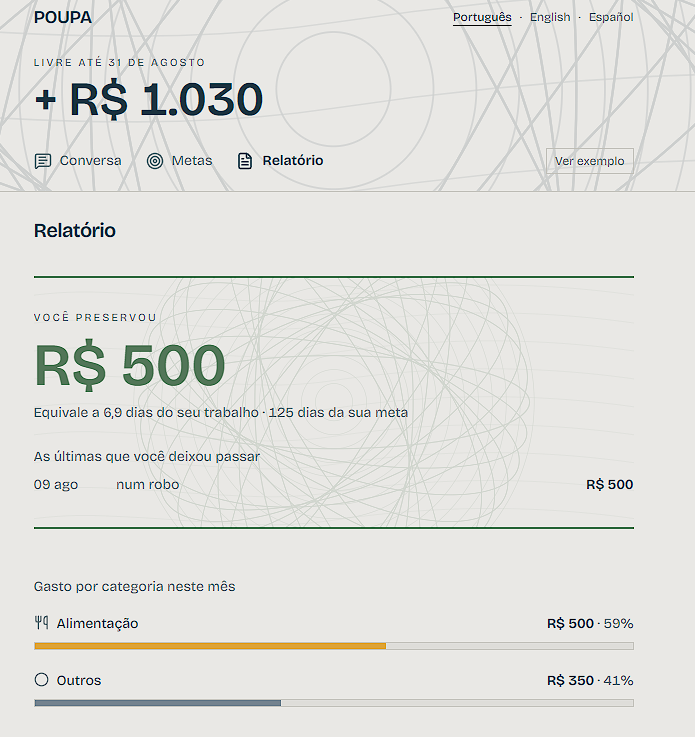
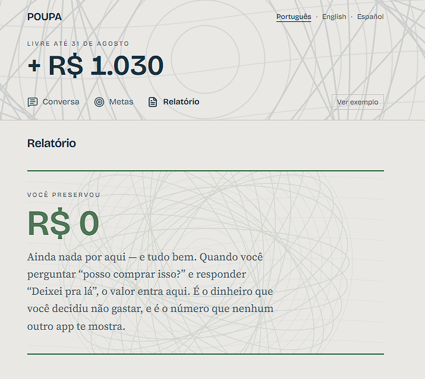

# 💸 Poupa — decida antes de gastar

> **Todo app de finanças mostra o que você gastou. O Poupa mostra o que você conseguiu não gastar.**

Este é o meu projeto para o desafio **App de Organização de Finanças Pessoais com Vibe Coding**, da DIO.
Construí o conceito conversando com IA — PRD, prompts, agente, telas e um app funcionando de verdade.

| | |
|---|---|
| 🔗 **App no ar** | **[poupa-money-buddy.lovable.app](https://poupa-money-buddy.lovable.app)** |
| 💻 **Código-fonte** | [poupa-money-buddy](https://github.com/E-A-D-S/poupa-money-buddy) |

> Abra o link e clique em **Ver exemplo**, no canto superior direito: o app carrega um mês inteiro de dados e você vê tudo funcionando sem precisar digitar nada.

> **Você está na entrega do desafio** — o fork do repositório-base da DIO, com o PRD, os prints e a reflexão. O código do app é gerado e hospedado pelo Lovable no repositório do link acima, que ele mantém sincronizado. O conteúdo deste README é o mesmo nos dois.

---

## 📌 Índice

- [O problema que eu quis resolver](#-o-problema-que-eu-quis-resolver)
- [A tese do produto](#-a-tese-do-produto)
- [O que o Poupa faz](#-o-que-o-poupa-faz)
- [Como usar — tutorial completo](#-como-usar--tutorial-completo)
- [Os diferenciais](#-os-diferenciais)
- [Acessibilidade](#-acessibilidade-não-é-um-modo-é-o-padrão)
- [Segurança e privacidade](#-segurança-e-privacidade)
- [O PRD (meu prompt final)](#-o-prd--meu-prompt-final)
- [Os prompts que usei](#-os-prompts-que-usei)
- [Prints das interações](#-prints-das-interações-com-a-ia)
- [Decisões de projeto](#️-decisões-de-projeto)
- [Reflexão sobre o processo](#-reflexão-sobre-o-processo)
- [Stack e como rodar](#️-stack-e-como-rodar)
- [Sobre o desafio](#-sobre-o-desafio)

---

## 🎯 O problema que eu quis resolver

O enunciado do desafio fala que as pessoas desistem de controlar as finanças porque os apps exigem entrada manual demais. Concordo — mas na minha leitura o atrito é só **um** dos motivos. São três, e eles se somam:

1. **Atrito.** Cada gasto exige abrir o app, escolher categoria num menu, digitar valor, salvar.
2. **Vergonha.** O app pinta o vermelho, avisa que você estourou o orçamento, e abrir a tela vira julgamento. Quem já está mal com dinheiro simplesmente não volta.
3. **Chega tarde.** Todo app de finanças é contabilidade do passado. Ele conta quanto você gastou *depois* que o dinheiro já saiu — quando não existe mais decisão a tomar.

O terceiro é o que quase ninguém ataca. E é o que o Poupa ataca.

## 💡 A tese do produto

> **O Poupa não serve para registrar o que você gastou. Serve para te ajudar no segundo antes de gastar.**

Você pergunta *"posso comprar um tênis de 400?"* e recebe a **sua** conta na hora: quanto sobra no mês, quantos dias isso adia a sua meta, e uma alternativa se não couber.

E quando você decide **não** comprar, o app registra. Esse número — o que você não gastou — é a única métrica que ninguém consegue ver sozinho.

**Público:** pessoas começando a organizar as finanças, que já desistiram antes. Sem repertório financeiro e sem paciência para planilha. Inclui explicitamente quem costuma ficar de fora: quem não entende jargão de banco, quem tem daltonismo e não distingue vermelho de verde num extrato, e quem sente vergonha de olhar a própria conta.

---

## 📱 O que o Poupa faz

| # | Funcionalidade | Como funciona |
|---|---|---|
| 1 | **Registrar gasto por conversa** | Você escreve `gastei 45 no mercado ontem` e a Nina entende valor, categoria e data |
| 2 | **Classificação automática** | Seis categorias atribuídas por palavra-chave, com correção em um toque |
| 3 | **Metas financeiras** | Valor-alvo, progresso e prazo estimado no seu ritmo |
| 4 | **Agente Financeiro (Nina)** | Responde *"posso comprar isso?"* com a conta real, sem julgamento |
| 5 | **Relatório simples** | Abre pelo dinheiro preservado, e mostra cada gasto no dia em que aconteceu |
| + | **Consulta em conversa** | *"quanto sobrou?"*, *"como está minha meta?"* — respondidas com a conta que produziu o número |

Tudo por conversa. Sem formulário, sem planilha, sem menu suspenso de categoria.

---

## 🧭 Como usar — tutorial completo

### Primeiro acesso: três perguntas e pronto

Não existe cadastro, senha ou e-mail. O app abre perguntando três coisas, uma de cada vez:

1. **"Quanto entra por mês, mais ou menos?"** — pode ser aproximado. É daqui que sai o cálculo de quantas horas do seu trabalho custa cada compra.
2. **"Quanto você gostaria de guardar por mês?"** — comece pequeno, dá para mudar depois.
3. **"Guardar para quê?"** — vira o nome da sua meta.

Respondeu as três, você já está dentro.

### 💬 Tela de Conversa — onde tudo acontece

É a tela inicial. Não é um painel com gráficos: é um diálogo.

**Para registrar um gasto**, escreva do jeito que você falaria:

```
gastei 45 no mercado ontem
almoço 32
uber 18
paguei 80 de gasolina sexta
mercado 152,80
```

A Nina entende:
- **valor** em qualquer formato — `45`, `45,90`, `R$45`, `R$ 45,90`, e até `quarenta e cinco`
- **data** — `hoje`, `ontem`, `anteontem`, dias da semana (`sexta`), ou `dia 12`. Sem data, ela assume hoje.
- **categoria** — pela palavra-chave (mercado → Alimentação, uber → Transporte, aluguel → Moradia…)

E responde assim:

```
Anotei. Alimentação, ontem.
● Alimentação  ↘  − R$ 45  ·  2,6h do seu trabalho
```

> 💡 **Repare no "2,6h do seu trabalho".** Todo valor no Poupa aparece traduzido em tempo de vida. R$ 45 não diz nada para quem está começando; "duas horas e meia trabalhando" diz.

**Botão `[ não era isso ]`** — aparece ao lado de cada gasto registrado. Ele abre duas opções:
- **Trocar a categoria** — clique na certa e a Nina confirma: *"Certo, anotei que 'Zé' é Alimentação."*
- **Desfazer** — apaga o registro inteiro.

> Escolhi **não** pedir confirmação antes de gravar. Um "posso registrar? sim/não" dobraria o trabalho de cada lançamento — e atrito é exatamente o problema que o app combate. Registro na hora e deixo o erro barato de corrigir.

### 🛒 "Posso comprar isso?" — o coração do app

Esta é **a** função. Escreva:

```
posso comprar um tênis de 400?
dá pra comprar um fone de 250?
consigo gastar 800 num celular?
```

A Nina não responde sim ou não. Ela mostra a conta:

```
Cabe, mas aperta.
Sobrariam R$ 280 livres neste mês.
Sua meta "viagem" atrasaria 8 dias.
```

**O cálculo é transparente** (nada de "a IA achou"):

```
saldoLivre    = renda do mês − gastos já feitos − quanto você quer guardar
dias de atraso = valor ÷ (quanto você guarda por mês ÷ 30)

valor ≤ metade do saldo livre  →  "Cabe tranquilo."
valor ≤ saldo livre            →  "Cabe, mas aperta."
valor > saldo livre            →  "Esse mês não fecha."
```

**Quando a compra não cabe, entra uma quarta linha** — a saída concreta, no lugar da bronca:

```
Esse mês não fecha.
Sobrariam R$ 0 livres neste mês.
Sua meta "viagem" atrasaria 60 dias.
Se quiser manter a meta intacta, o confortável hoje seria R$ 340.
```

Ela nunca sugere um teto quando a compra já coube — seria ruído.

**E aí aparecem os dois botões:**

| Botão | O que faz |
|---|---|
| **`Comprei`** | Registra a compra como gasto normal, na categoria certa |
| **`Deixei pra lá`** | Guarda como **dinheiro preservado** e soma no seu acumulado |

Ao clicar em `Deixei pra lá`, a Nina responde:

```
Anotado. Você já preservou R$ 1.240 — 92h do seu trabalho.
```

### 💰 Perguntar como você está

A Nina também responde sobre a sua situação, sem você precisar sair da conversa:

```
quanto sobrou?
quanto ainda tenho?
quanto posso gastar?
como estou?
```

```
Sobram R$ 610,25 até 31 de agosto.
Você já gastou R$ 2.689,75 este mês, e R$ 500 estão reservados para a sua meta.
```

Repare que ela nunca dá só o número: mostra **a conta que produziu o número**. É o princípio *sem surpresa* — se você não entende de onde veio, não confia.

E sobre a meta:

```
como está minha meta?
quanto falta pra meta?
```

> 💡 **O saldo também fica sempre visível.** O cabeçalho é fixo e **encolhe conforme você rola**: o número grande vira um número pequeno ao lado do nome do app, mas nunca some da tela. Em conversa longa você não precisa voltar ao topo para saber quanto ainda sobra.

### 🎯 Tela de Metas

Mostra a meta que nasceu da terceira pergunta do onboarding.

- Se ainda não existe, ela pergunta **quanto você quer juntar** e sugere um valor (12 meses no seu ritmo)
- Depois de criada: **nome, quanto já tem, quanto falta e o prazo estimado** — *"No seu ritmo, faltam cerca de 5 meses."*
- **Barra de progresso com a porcentagem escrita ao lado** — nunca só a cor
- **Campo `Guardei`** — registre quando separar dinheiro, e o progresso anda
- Dá para criar outras metas e excluir as que não servem mais

### 📊 Tela de Relatório

Aqui está a inversão que define o produto: **o relatório abre pelo que você não gastou.**

**1. Dinheiro preservado** — em destaque, com faixa verde-cédula e o guilhoché ao fundo:

```
VOCÊ PRESERVOU
R$ 1.240
Equivale a 92h do seu trabalho · 74 dias da sua meta
```

Logo abaixo, as últimas compras que você deixou passar, com data e valor.

**2. Gasto por categoria** — barras horizontais com ícone, nome escrito, valor e porcentagem. **Sem gráfico de pizza**: pizza é bonita e ruim de ler, ainda mais para quem não distingue as cores.

**3. Comparação com o mês anterior**, em português claro: *"Você gastou R$ 180 a menos que em julho."*

**4. Cada gasto, no dia em que aconteceu** — a lista completa do mês, com a **data real do gasto**, não a data em que você anotou. Se hoje você registrar algo de terça, aqui aparece terça.

### 🔎 Botão `Ver exemplo` — modo demonstração

No canto superior direito. Ele popula o app com um mês inteiro de vida: 22 gastos nas seis categorias, uma conversa em andamento, uma meta a 60% e três decisões evitadas somando R$ 1.240.

Serve para você (ou qualquer pessoa) ver o app funcionando **sem precisar digitar nada**. Enquanto está ligado, uma faixa no topo avisa: *"Modo demonstração — dados de exemplo"*.

Clicou em `Sair do exemplo`, **os seus dados reais voltam intactos** — eles ficam guardados enquanto a demonstração roda.

### 🌍 Idiomas: `Português · English · Español`

No topo, à direita. Troca a interface inteira, inclusive as falas da Nina.

> **Por que nome de idioma e não bandeirinha?** Porque bandeira representa país, não idioma. Espanhol é falado em mais de vinte países — a bandeira da Espanha é a menos representativa para o público hispanofalante mais provável de um app brasileiro. O mesmo vale para inglês com bandeira dos EUA.

**Os valores continuam em Real nos três idiomas.** Traduzi a interface, não a moeda — é um app brasileiro acessível a quem não lê português, não um app internacional.

**E não é só a interface: a Nina entende os três idiomas.** O reconhecimento de gasto, de data e de pergunta funciona em português, inglês e espanhol:

```
I spent 45 at the market yesterday
can I buy sneakers for 400?
how much is left?

gasté 45 en el mercado ayer
¿puedo comprar unos tenis de 400?
¿cuánto queda?
```

Traduzir só os rótulos e deixar o cérebro do app falando um idioma só seria uma tradução de fachada.

### 🗑️ `Apagar meus dados`

No rodapé, junto do aviso de protótipo. Pede confirmação e apaga tudo. E apaga mesmo: **não existe servidor para guardar cópia.**

---

## ⭐ Os diferenciais

### De produto

- **"Posso comprar isso?"** — decisão antes da compra, não relatório depois. É o que justifica o app ser uma conversa: não dá para fazer isso num formulário.
- **Preço em moeda pessoal** — todo valor traduzido em horas do seu trabalho e dias da sua meta.
- **Dinheiro preservado** — o acumulado do que você não gastou, com as horas de trabalho equivalentes. Nenhum app mostra isso.
- **Agente sem julgamento** — a Nina nunca diz "você gastou demais". E quem some por três semanas é recebido de volta sem cobrança, porque é exatamente aí que as pessoas desistem de vez.
- **Onboarding em três perguntas** — sem cadastro, sem senha, sem e-mail.
- **Estados vazios que ensinam** — nenhuma tela diz "nenhum registro encontrado". A Nina puxa conversa.

### De inclusão

- **Três idiomas de verdade** — identificados pelo nome, e com a Nina entendendo gasto, data e pergunta nos três, não só os rótulos traduzidos.
- **Acessível por padrão** — detalhado na próxima seção.
- **Cabeçalho que encolhe ao rolar** — o saldo nunca sai da tela, mesmo em conversa longa.

### De execução

- **App publicado e funcionando**, não só conceito no papel.
- **Modo demonstração** — quem abre o link vê o app vivo em 5 segundos.
- **Cinco decisões documentadas** com alternativa e trade-off.

---

## ♿ Acessibilidade não é um modo, é o padrão

Num app de finanças, a cor **carrega significado**: vermelho é gasto, verde é economia. E o daltonismo vermelho-verde atinge cerca de **8% dos homens**. Ou seja: o app de finanças convencional é ilegível para quase um em cada doze usuários homens.

Eu pensei em fazer um botão de "modo daltônico". Decidi que não — **um modo é remendo**: exige que a pessoa saiba que ele existe e vá procurá-lo.

Em vez disso, virou regra estrutural: **a cor nunca é a única portadora de significado.**

- Todo valor tem **sinal** (`−`), **ícone** e **rótulo escrito**, além da cor
- O relatório usa **barras com nome e porcentagem escritos**, não pizza
- Progresso de meta mostra a **porcentagem em número**, não só a barra
- As seis cores de categoria têm **luminosidades diferentes entre si**
- Texto sempre tinta sobre papel; as cores de acento só em áreas grandes
- Foco de teclado visível, `prefers-reduced-motion` respeitado, `aria-label` em todo ícone

**O teste que isso passa:** imprima qualquer tela em preto e branco. Se continua compreensível, passa. E passa.

E tem uma coincidência que eu achei bonita: **a regra que serve ao daltonismo é a mesma que elimina o vermelho acusatório** que o agente sem julgamento precisava evitar. Duas exigências independentes, uma solução só.

---

## 🔒 Segurança e privacidade

A postura de segurança aqui vem da **arquitetura**, não de controles empilhados depois.

| Risco | Situação | Por quê |
|---|---|---|
| Chave de API vazada em repositório público | **Eliminado** | Não existe chave — o agente é determinístico |
| Vazamento de banco / RLS mal configurada | **Eliminado** | Não existe banco |
| LGPD | **Fora de escopo** | Nenhum dado sai do navegador |
| XSS no campo de conversa | **Controlado** | Entrada do usuário nunca é renderizada como HTML |
| Dado em máquina compartilhada | **Mitigado** | Aviso de protótipo + botão de apagar tudo |

Antes de subir o código eu auditei: nenhum segredo no repositório, nenhum `.env`, nenhuma chamada a serviço externo, `node_modules` fora do versionamento e **zero vulnerabilidades** no `npm audit`.

> **O princípio:** o código mais seguro é o que não existe. Sem servidor, sem chave e sem banco, a superfície de ataque quase desaparece.

---

## 📄 O PRD — meu prompt final

Este é o documento que serviu de briefing para a IA. Ele também está no **Knowledge do projeto no Lovable**, o que faz com que valha para *todas* as mensagens, não só a primeira.

```markdown
# Contexto
Quero criar um aplicativo de Organização de Finanças Pessoais chamado "Poupa",
que funcione por meio de conversa. O usuário escreve o que gastou do jeito que
falaria com uma pessoa — "gastei 45 no mercado ontem" — e o app entende,
classifica e responde. Sem formulário, sem planilha, sem menu de categoria.

# Problema
As pessoas abandonam o controle financeiro por três motivos somados:
1. Atrito — cada gasto exige abrir o app, escolher categoria, digitar, salvar.
2. Vergonha — o app mostra vermelho, avisa que estourou o orçamento, vira
   julgamento. Quem já está mal com dinheiro não volta.
3. Chega tarde — é contabilidade do passado, quando não há mais decisão a tomar.

# A proposta
O Poupa não serve para registrar o que você gastou. Serve para ajudar no segundo
antes de gastar. O usuário pergunta "posso comprar um tênis de 400?" e recebe a
conta dele na hora. Quando decide não comprar, o app registra: todo app mostra o
que você gastou, o Poupa mostra o que você conseguiu não gastar.

# Público-Alvo
Pessoas começando a organizar as finanças, que já desistiram antes. Sem repertório
financeiro, sem paciência para planilha. Inclui quem não entende jargão de banco,
quem tem daltonismo, e quem sente vergonha de olhar a própria conta.

# Funcionalidades-Chave
1. Registrar gastos via chat em linguagem natural.
2. Classificar automaticamente as transações, com correção em um toque.
3. Definir e acompanhar metas financeiras.
4. Receber a conta real do "Agente Financeiro" (Nina) ao perguntar
   "posso comprar isso?".
5. Visualizar relatório simples, abrindo pelo dinheiro preservado.

# Princípios de Experiência
SEM CULPA — informa, nunca repreende.
SEM JARGÃO — fala como as pessoas falam.
SEM SURPRESA — toda conclusão vem com a conta que a produziu.
SEM DEPENDER DE COR — toda informação importante tem sinal, ícone e texto.

# Moeda Pessoal (fundamento, não funcionalidade)
O Poupa nunca mostra apenas dinheiro. Todo valor vem com significado pessoal.
Para quem recebe R$ 3.800 por mês e guarda R$ 500:
  R$ 120  ≈ 6,9 horas do seu trabalho  ≈ 7 dias da sua meta
Fórmulas: horas = valor ÷ (rendaMensal ÷ 220)
          dias de meta = valor ÷ (guardarPorMes ÷ 30)

# Método de resposta da Nina para "posso comprar isso?"
1. O veredito, curto e sem julgamento
2. Quanto sobraria livre no mês
3. Quantos dias isso adia a meta (se houver meta definida)
4. O valor máximo confortável hoje — SOMENTE quando a compra não couber

As três primeiras linhas são fixas; a quarta é condicional. Quando a compra cabe,
sugerir um teto seria ruído.

# Cálculo (determinístico, sem ambiguidade)
saldoLivre = rendaMensal − somaGastosDoMes − guardarPorMes
  valor <= saldoLivre × 0,5  →  "Cabe tranquilo."
  valor <= saldoLivre        →  "Cabe, mas aperta."
  valor >  saldoLivre        →  "Esse mês não fecha."

# Arquitetura (obrigatória)
Estado 100% no navegador (localStorage). SEM banco, SEM API externa, SEM chave de
API. O agente é determinístico: interpreta por regras, não chama LLM — sem backend
a chave viveria no cliente, e projeto gratuito é público.

# Identidade Visual
Inspiração: cédula do Real — papel de algodão, tinta calcográfica, guilhoché.
  papel #ECEBE6 · tinta #16323F · tinta-suave #5A6B70 · verde-cédula #4F7A5C
Categorias com as cores das notas: Alimentação #E0A020 · Transporte #3D5A80 ·
Moradia #B8845F · Lazer #8E7CA8 · Compras #C4553B · Outros #7A8B99
Tipografia: "Bricolage Grotesque" (números e interface, numerais tabulares) e
"Source Serif 4" (só as falas da Nina).
PROIBIDO: Inter, gradientes, glassmorphism, cards com sombra suave, gráfico de
pizza, emoji como ícone, azul-marinho com verde-neon.

# Idiomas
pt-BR, en e es, pelo NOME do idioma, nunca por bandeira.
Valores sempre em Real (R$) nos três idiomas.

# Entregável da IA
Gerar um plano de MVP com as principais telas, recursos necessários e um esboço
de validação inicial. Usar tom educativo e linguagem acessível, em português.

# Hipótese principal do projeto
As pessoas usarão o Poupa ANTES de gastar, e não apenas para registrar gastos.
Se for verdadeira, existe produto. Se for falsa, é só mais um registrador por chat.
```

### Plano de validação inicial

| Métrica | Alvo | Por que ela importa |
|---|---|---|
| Tempo para registrar um gasto | < 10 s | O atrito é o problema declarado |
| Acerto da classificação automática | ≥ 80% | Errar muito quebra a confiança |
| Uso do "posso comprar isso?" | ≥ 1 por semana | É o diferencial. Se ninguém usa, a tese está errada |
| Compras evitadas registradas | ≥ 1 por semana | O comportamento-alvo não é registrar, é evitar |
| Retorno após 7 dias sem uso | ≥ 40% | Mede se o tom sem julgamento funciona |
| Compreensão sem explicação | 5 de 5 pessoas | Regra dos 5 usuários — o público é iniciante |

**Teste mais barato para falsificar a tese:** mostrar a tela do "posso comprar isso?" para 5 pessoas do público-alvo e perguntar o que fariam em seguida. Se nenhuma disser que usaria antes de comprar, o diferencial não se sustenta.

---

## 🪄 Os prompts que usei

O plano gratuito do Lovable dá **5 mensagens por dia**. Então eu não improvisei: montei a sequência inteira antes de abrir o site.

### Passo 0 — o PRD no Knowledge (custo: 0 créditos)

Descobri que o Lovable tem um campo **Project Knowledge** (Project Settings → Knowledge, até 10.000 caracteres) que é lido em **toda** mensagem. Colei o PRD ali.

Isso mudou tudo: como o contexto pesado ficou permanente, os prompts seguintes puderam ser curtos e diretos — e prompt curto é prompt que a IA não ignora pela metade. **E não gastou nenhum crédito**, porque campo de configuração não é mensagem de chat.

### Prompt 1 — as três entregas do desafio (1 crédito)

Pedi em texto, antes de qualquer código: o **Agente Financeiro** (comportamento e tom, com três exemplos de fala), o **Fluxo de Telas** e o **Plano de MVP** com as métricas de validação.

### Prompt 2 — a fundação (1 crédito)

Design system completo, quatro rotas, três idiomas, regras de acessibilidade, onboarding e a tela de conversa com o registro em linguagem natural.

O prompt terminava com um **checklist de autoverificação** obrigando a IA a confirmar item por item antes de entregar. Funcionou: ela devolveu os doze itens marcados.

> 🎁 **Bônus inesperado:** o "posso comprar isso?" *não estava* neste prompt — mas como o método e o cálculo estavam no Knowledge, a IA implementou por conta própria. Foi a prova de que o Knowledge estava fazendo efeito.

### O terceiro prompt nunca aconteceu

Meu plano tinha mais dois: um para o "posso comprar isso?" com as metas, outro para o relatório e o modo demonstração. **Os créditos acabaram antes.**

Não foi desperdício: o prompt da fundação entregou mais do que eu pedi — o "posso comprar isso?" veio junto, porque o método e a fórmula estavam no Knowledge. O que faltava foi construído depois, pelo caminho do GitHub. Conto na [reflexão](#-reflexão-sobre-o-processo).

---

## 📸 Prints das interações com a IA

### 1. O PRD sendo revisado no Copilot Web

Colei o PRD e pedi crítica. Vieram dez sugestões — aceitei nove e recusei duas, com fundamento.





### 2. O PRD no Project Knowledge do Lovable

Aqui, e não num prompt: o contexto passa a valer em **toda** mensagem, sem gastar crédito.



### 3. As três entregas pedidas pelo desafio

O primeiro prompt não construiu nada — pediu o **Agente Financeiro**, o **Fluxo de Telas** e o **Plano de MVP** em texto.



### 4. O app: registrar gasto conversando



### 5. O app: "posso comprar isso?" e os dois botões



### 6. Corrigir uma classificação errada em um toque



### 7. O relatório abrindo pelo dinheiro preservado



E quando ainda não há nada preservado, o zero **ensina** em vez de ficar mudo:



---

## ⚖️ Decisões de projeto

Cinco decisões que moldaram o app, cada uma com a alternativa que descartei e o custo que aceitei.

<details>
<summary><b>D-01 · Sem backend, estado no navegador</b></summary>

**Alternativas:** (A) Supabase, com banco real e autenticação · (B) localStorage.

**Escolhi B.** O orçamento era de 5 mensagens por dia. Conectar banco, criar tabelas e configurar Row Level Security consumiria pelo menos dois créditos — e RLS mal configurada é a falha mais comum em app gerado por IA, o que custaria mais créditos ainda para corrigir. O desafio pede um conceito funcional, não um produto em produção.

**Custo aceito:** os dados não sobrevivem à troca de navegador, e não há multiusuário. Para um protótipo de validação, é irrelevante.

**Ganho de brinde:** sem banco, some a classe inteira de vulnerabilidade por permissão mal configurada.
</details>

<details>
<summary><b>D-02 · O agente não chama modelo de linguagem</b></summary>

**Alternativas:** (A) chamar uma API de IA para interpretar o texto · (B) interpretar por regras em TypeScript.

**Escolhi B.** Sem backend, a chave de API viveria no cliente. E projeto gratuito no Lovable é **público** — chave em repositório público é varrida por bot em minutos.

A saída não era esconder melhor a chave. Era **não ter chave**.

**Custo aceito:** o agente entende menos variações de frase do que um modelo entenderia. Em troca, é previsível, instantâneo, gratuito e não vaza nada.
</details>

<details>
<summary><b>D-03 · Traduzi a interface, não a moeda</b></summary>

**Alternativas:** (A) converter para USD e EUR conforme o idioma · (B) manter R$ nos três.

**Escolhi B.** Conversão exige taxa de câmbio em tempo real — ou seja, uma API externa, que a decisão D-02 acabou de eliminar. E quebraria o cálculo de horas de trabalho, que parte de uma renda em reais.

**Custo aceito:** quem usa a interface em inglês vê valores em reais. É coerente: é um app brasileiro acessível, não um app internacional.
</details>

<details>
<summary><b>D-04 · Nomes de idioma, não bandeiras</b></summary>

**Alternativas:** (A) três bandeiras · (B) os nomes escritos.

**Escolhi B.** Bandeira representa país, não idioma. É recomendação consolidada de internacionalização, e ainda funciona melhor para leitor de tela.

**Custo aceito:** ocupa mais espaço que três ícones. Vale.
</details>

<details>
<summary><b>D-05 · Não fiz um modo daltônico</b></summary>

**Alternativas:** (A) um botão "modo daltônico" que troca a paleta · (B) nunca usar cor como única portadora de significado.

**Escolhi B.** Um modo é remendo: exige que a pessoa saiba que ele existe e vá procurá-lo. A regra estrutural funciona para todo mundo, o tempo todo, sem configuração.

**Custo aceito:** nenhum. Custou disciplina, não código.
</details>

---

## 🤔 Reflexão sobre o processo

### ✅ O que funcionou bem

**Colocar o PRD no Project Knowledge, e não num prompt.** Foi a melhor decisão técnica do desafio. O contexto passou a valer em toda mensagem, os prompts ficaram curtos, e sobrou atenção da IA para o que realmente importava. A prova veio sozinha: ela implementou o "posso comprar isso?" sem eu ter pedido naquele prompt, porque o método estava no Knowledge.

**O checklist de autoverificação no fim do prompt.** Terminar com *"antes de terminar, confirme item por item que você implementou: [...]"* mudou o resultado. A IA voltou com os doze itens conferidos. Sem isso, ela costuma entregar 70% e não avisar o que ficou de fora.

**Dizer o que é PROIBIDO, e não só o que eu queria.** "Faça bonito" produz o visual padrão de IA. Listar *"sem fonte Inter, sem gradiente, sem card com sombra suave, sem gráfico de pizza"* produziu identidade. Restrição funciona melhor que elogio.

**Discordar do Copilot.** Pedi que ele revisasse meu PRD e vieram dez sugestões. Aceitei nove. Recusei duas — e recusar foi o que mais me ensinou. Ele sugeriu confirmação obrigatória antes de gravar cada gasto, o que aumentaria o atrito que o produto existe para combater. E sugeriu trocar meu critério de aceite "a tela impressa em preto e branco continua compreensível" por "nenhuma informação depende de cor" — que não é mais objetivo, é mais abstrato: trocaria um teste executável por uma reafirmação da regra.

### ❌ O que não funcionou como o esperado

**A conta dos créditos.** Este foi o tropeço grande. A documentação do Lovable diz que cada mensagem custa 1 crédito. Planejei quatro prompts com folga de um. Na prática, **os cinco créditos do dia acabaram no terceiro prompt** — build complexo consome mais.

Foi um susto de verdade, porque eu tinha prazo. Duas coisas me salvaram:

1. **O desafio não exige código funcionando** — está escrito com todas as letras no enunciado. Com o PRD, as três entregas e os prints, a entrega já era válida.
2. **A sincronização de duas vias com o GitHub.** Conectei o repositório e segui dali: **as alterações continuaram sendo geradas por IA a partir das minhas instruções** — não escrevi uma única linha à mão em nenhum momento do projeto — e o push devolve tudo para dentro do Lovable, que sincroniza sozinho e **não consome crédito nenhum**. O app seguiu sendo o app do Lovable; mudou só por onde eu conversava com a IA.

> 🔎 **Registrando com precisão, porque a honestidade do processo é o que está sendo avaliado:** a fundação do app foi gerada **no Lovable, por prompt**. O PRD foi lapidado **no Copilot**. Da parada dos créditos em diante, o código continuou sendo **gerado por IA a partir de instruções minhas** e devolvido ao Lovable pelo GitHub. Em nenhuma etapa houve digitação manual de código — o que muda entre as fases é a janela onde eu conversava, não o método.

**O visual saiu contido demais na primeira versão.** Eu tinha pedido "nada genérico" e a IA entregou algo sóbrio e disciplinado — mas apagado. A paleta de seis cores das cédulas só aparecia em barras de 8 pixels no relatório, e o guilhoché estava a 6% de opacidade, praticamente invisível.

O erro foi meu: pedi contenção sem pedir **assinatura**. Design minimalista precisa de um momento forte que segure o olhar. Corrigi depois — o saldo virou número grande com a textura do guilhoché atrás, as cores das categorias passaram a aparecer na conversa, e o "Você preservou" ganhou o tamanho que merecia.

**Faltou pedir a data no relatório.** Descrevi bem o registro de gasto — "aceite ontem, anteontem, dia 12" — mas nunca disse onde essa data deveria **aparecer** depois. Resultado: o app capturava a data corretamente e nunca a mostrava. Se eu anotasse hoje um gasto de terça, o relatório não dizia terça. Só percebi testando.

**E foi testando de verdade que os erros mais interessantes apareceram.** Sentei e conversei com o app como um usuário faria, e ele me devolveu cinco falhas que nenhuma revisão de texto teria pegado:

| O que eu digitei | O que aconteceu | Por quê |
|---|---|---|
| `gastei 5 num pastel` | Classificou como **Moradia** | `gás` é palavra-chave de Moradia, e casava dentro de "**gas**tei" |
| `gastei 30 no corte de cabelo` | Virou **pergunta de compra** | `cabe` é gatilho de pergunta, e casava dentro de "**cabe**lo" |
| `posso comprar uma vassoura?` | Respondeu que **cabia R$ 1** | "uma" é artigo, mas também é o número um |
| `quanto sobrou?` | *"Não entendi"* | O assistente não sabia responder a pergunta mais óbvia que existe |
| `...como anotou 1 real gasto?` | Registrou **R$ 1 de despesa** | Nada impedia uma pergunta de virar gasto |

Os três primeiros são **o mesmo erro**: comparar pedaço de palavra em vez de palavra inteira. Um erro só, com três disfarces — e eu só enxerguei o padrão depois de ver os três juntos.

O quarto me incomodou mais que os outros. O saldo está no cabeçalho, calculado, ali do lado. Recusar-se a dizer o número que se sabe faz o assistente parecer burro — e isso contamina a confiança em tudo o que ele responde bem. Um app que se propõe a conversar precisa responder à pergunta mais natural da conversa.

### 🧠 O que aprendi sobre conversar com IAs

**Contexto permanente vale mais que prompt longo.** Um prompt gigante compete consigo mesmo por atenção. O mesmo conteúdo num campo de contexto persistente vale para todas as mensagens e ainda deixa cada pedido curto e específico.

**Restrição é mais eficaz que instrução.** IA obedece "não faça X" muito melhor do que interpreta "faça algo bacana". Minha lista de proibições produziu mais identidade visual do que qualquer adjetivo elogioso teria produzido.

**Peça para ela conferir o próprio trabalho.** O checklist final é barato de escrever e muda o resultado.

**Descrever o comportamento não basta — é preciso descrever o cálculo.** Eu tinha explicado bem *o que* a Nina deveria responder, mas não *como* chegar no número. A revisão do Copilot pegou isso, e foi a sugestão mais valiosa que recebi: sem a fórmula explícita, o agente daria respostas inconsistentes entre uma pergunta e outra.

**Descrever a entrada não é descrever a saída.** A falha da data me ensinou isso. Eu disse como interpretar a data, mas nunca disse onde exibi-la. A IA fez exatamente o que eu pedi — o problema é que eu não pedi tudo.

**Nenhuma revisão substitui usar a coisa.** Eu revisei o PRD com uma IA, a IA revisou o próprio trabalho com checklist, e o build passava sem um único erro. Mesmo assim o app confundia "gastei" com "gás" e achava que uma vassoura custava R$ 1. Os cinco defeitos que mais importavam só apareceram quando eu sentei e conversei com ele como um usuário faria. **Código que compila não é código que funciona.**

**Traduzir a interface não é traduzir o app.** Eu tinha três idiomas nos botões e nos rótulos, mas o cérebro que interpreta as frases só entendia português. Um usuário em inglês escreveria "I spent 45 at the market" e receberia "Outros, hoje" — tradução de fachada. Coerência de idioma vai até onde vai a lógica, não até onde vai o texto.

**E o principal: a IA não decide o que vale a pena.** Ela executou bem cada coisa que pedi. Mas a escolha de atacar o momento *antes* da compra em vez do registro depois, a de mostrar o que não foi gasto, a de recusar duas sugestões de revisão, a de não fazer um modo daltônico e resolver na raiz — nenhuma dessas veio dela. Vieram de mim.

> Vibe Coding não é a IA pensando no meu lugar. É eu pensando com clareza suficiente para que ela consiga executar.

---

## 🛠️ Stack e como rodar

**React 19 · TypeScript · Vite · Tailwind CSS 4 · TanStack Start / Router · Nitro · localStorage**

O projeto nasce do template TanStack Start do Lovable, que traz **Nitro** como motor de servidor e capacidade de renderização no servidor. **Nada disso é usado para dados.** Não existe rota de API, banco, autenticação nem chave de serviço: cada transação, meta e decisão vive no `localStorage` do navegador de quem usa. O servidor entrega os arquivos da página e nada mais.

Registro isso por precisão: a seção de segurança se apoia em "não existe servidor guardando nada", e é justo mostrar que o motor de servidor existe no template — só não passa dado por ele.

```bash
git clone https://github.com/E-A-D-S/poupa-money-buddy.git
cd poupa-money-buddy

# o projeto foi instalado com bun (há um bun.lock na raiz)
bun install
bun run dev

# funciona com npm também, mas resolve versões próprias
npm install
npm run dev
```

Abra o endereço que aparecer no terminal.

---

## 📚 Sobre o desafio

Projeto desenvolvido para o desafio **App de Organização de Finanças Pessoais com Vibe Coding**, da [DIO](https://dio.me).

**Nenhuma linha de código foi escrita à mão.** Tudo — modelo de dados, telas, lógica de conversa, correções — saiu de prompt e instrução para IA, do primeiro commit ao último. É literalmente o que o desafio propõe: *"a prova de que você domina o raciocínio de Vibe Coding, mesmo sem escrever uma única linha de código."*

| Ferramenta | Papel |
|---|---|
| **Lovable** | Geração da fundação do app, preview e hospedagem |
| **Microsoft Copilot** | Revisão e lapidação do PRD |
| **GitHub** | Sincronização de duas vias com o Lovable, sem consumir crédito |

---

<div align="center">

**Poupa** — porque o dinheiro que você não gastou também conta.

</div>
